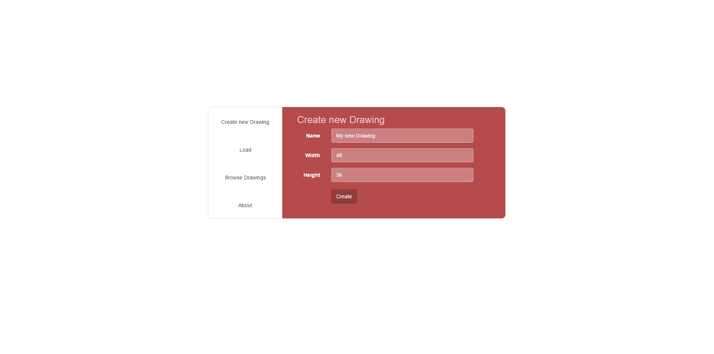
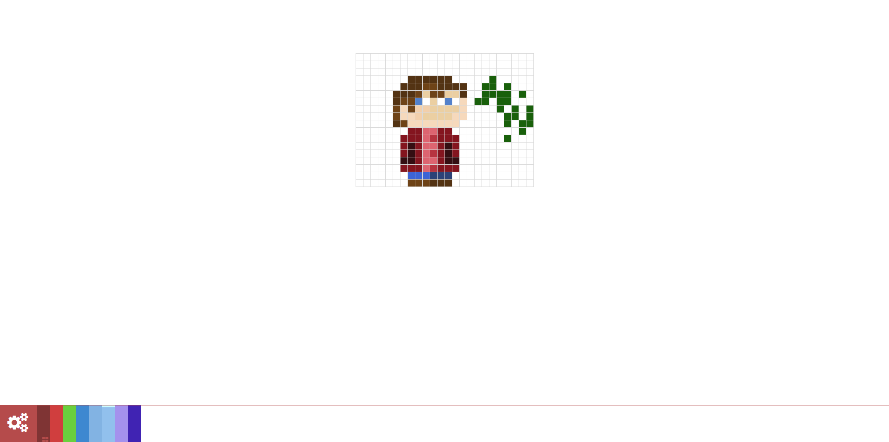
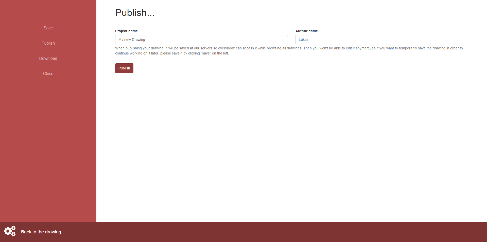
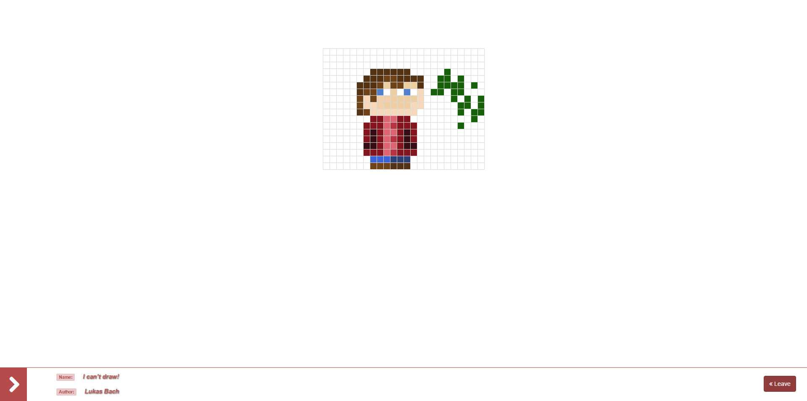

# Pixeldrawer

Pixel drawer is a basic online drawing software I worked on during my school time. It doesn’t have many features and was only an attempt to create an web app. However, it does work and allows people to share their drawings in a public gallery.

